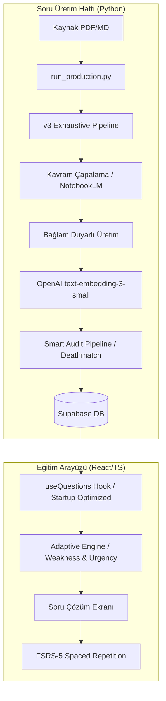

# 🦷 DUSBANKASI: Diş Hekimliğinde Uzmanlık Sınavı AI Eğitim Ekosistemi

**LLM (YAPAY ZEKA ASİSTAN) BAŞUCU MANİFESTOSU**

> [!IMPORTANT]
> **AI ASİSTAN:** Bu projede çalışmaya başladığınızda **İLK VE TEK REFERANSINIZ** bu belgedir. Projenin mimarisi, soru üretim kuralları ve klasör yapıları sıkı kurallara bağlanmıştır. Kullanıcının isteklerini bu belgeye göre yorumlayın.

DUSBANKASI, Diş Hekimliğinde Uzmanlık Sınavı (DUS) hazırlık sürecini **Yapay Zeka (AI)** ve **Bilişsel Bilim (Cognitive Science)** prensipleriyle optimize eden hibrit bir eğitim ekosistemidir.

---

## 🏛️ 1. MİMARİ BAKIŞ

**Tech Stack:** 
- **Frontend:** React 19 + TypeScript + Vite 6 · Tailwind CSS 4
- **Backend:** Supabase (PostgreSQL + pgvector 1536)
- **AI Engine:** Python 3.12 · NotebookLM · OpenAI (text-embedding-3-small 1536-dim)

Uygulama iki temel katmandan oluşur: **Frontend Katmanı (Eğitim Arayüzü)** ve **Soru Üretim Katmanı (Otonom Pipeline)**.

### Sistem Akış Şeması

---

## ⚙️ 2. KURULUM VE YAPILANDIRMA

### Ortam Değişkenleri

| Değişken | Açıklama | Lokasyon |
|---|---|---|
| `OPENAI_API_KEY` | Vektörleme (Embedding 1536) için | `scripts/config.py` |
| `GEMINI_API_KEY` | NotebookLM / Gemini işlemleri için | `scripts/config.py` |
| `VITE_SUPABASE_URL` | Supabase Proje URL | `.env.local` |
| `VITE_SUPABASE_ANON_KEY` | Supabase Anon Key | `.env.local` |
| `NOTEBOOK_ID` | Hedef NotebookLM ID | `scripts/config.py` |

### Bağımlılıklar
- **Python:** `pip install aiohttp openai google-genai numpy`
- **Frontend:** `npm install`

---

## 🤖 3. ÜRETİM PİPELİNE v3 (EXHAUSTIVE MODE)

Uygulama, kaynak dökümandaki hiçbir bilginin atlanmadığı **"Exhaustive Coverage"** (Kapsamlı Tarama) modundadır.

### 🚀 Üretim İş Akışı
1.  **Orkestrasyon:** `python scripts/run_production.py` komutuyla tüm ders klasörleri taranır.
2.  **Çapalama (Anchoring):** `notebooklm-exhaust.py` önce kaynaktaki tüm test edilebilir kavramları (enzim, mekanizma, patoloji vb.) "çapa" (anchor) olarak listeler.
3.  **Üretim:** Her çapa, en az bir sorunun birinci konusu olacak şekilde 25'lik dilimlerle NotebookLM'e gönderilir.
4.  **Kontrol:** DB'deki mevcut sorularla çapraz kontrol yapılır; sorulmamış kavram kalmayana kadar döngü devam eder.
5.  **Vektörleme:** Üretilen her soru anında **OpenAI 1536** boyutunda vektörlenerek Supabase'e itilir.

---

## 🧹 4. SMART AUDIT (ÖLÜM MAÇI)

Üretim sonrası kalite kontrolü, semantik benzerlik üzerinden yürütülür.

### Akıllı Kürasyon Mantığı
Sistem, `smart_audit_pipeline.py` üzerinden her yeni soru seti için bir **"Ölüm Maçı"** başlatır:
- **LSH Benzerlik:** MinHash LSH algoritması ile $O(\log N)$ hızında aday çiftler bulunur.
- **Vektörel Karşılaştırma:** Cosine similarity > 0.85 olan sorular "ikiz" kabul edilir.
- **Puanlama (Scoring):**
  - **Klinik Vaka (+10p):** Senaryo temelli sorular her zaman korunur.
  - **Düz Cevap (+5p):** "Nedir/Hangisidir" kökenli temel bilgi soruları.
  - **Olumsuz Kök (-15p):** "Değildir/Yanlıştır" soruları düşük kaliteli sayılır ve elenir.
  - **Uzunluk:** 10 kelimeden kısa sorulara ceza puanı verilir.

✅ **Sonuç:** Havuzda her zaman en kaliteli ve eşsiz sorular kalır.

---

## 🛠️ 5. ARAÇ ÇANTASI (SCRIPTS/TOOLS)

| Araç | Fonksiyon |
|---|---|
| `run_production.py` | **Manager:** Tüm üretim hattını sırayla tetikler. |
| `batch_rollback.py` | Hatalı üretimleri (tarih veya ders bazlı) saniyeler içinde geri alır. |
| `smart_audit_pipeline.py` | **Ölüm Maçı:** Semantik kopyaları temizler. |
| `split_pdf_auto.py` | Dev PDF'leri NotebookLM dostu 25 sayfalık ünitelere böler. |
| `requeue_rejected.py` | Kalite filtresinden dönen soruları tekrar denetler. |
| `semantic_dupe_count.py` | Veritabanındaki toplam semantik kopya oranını raporlar. |

---

## 💻 6. FRONTEND (UI/UX) VE COGNITIVE SCIENCE

Frontend katmanı, öğrenci performansını en üst düzeye çıkarmak için tasarlanmıştır.

### Bilişsel Motorlar
- **FSRS-5 (Free Spaced Repetition Scheduler):** Hatırlama eğrisini optimize ederek, bir soruyu tam unutmak üzereyken tekrar sorar.
- **Adaptive Engine (`lib/adaptive.ts`):** Bir sonraki soruyu seçerken şu sinyalleri kullanır:
  - **%50** FSRS Aciliyeti
  - **%35** Zayıf Olunan Konular
  - **%15** Yeni Keşif (Exploration)
- **Interleaving:** Ardışık olarak aynı dersin gelmesini önleyerek zihinsel uyanıklığı artırır.

### Design System (Apple/Linear Ekolü)
- **Minimalist UI:** Bilişsel yükü azaltmak için sadece gerekli elemanlar gösterilir.
- **Smooth Interaction:** Tailwind 4 ve CSS tokenları ile akıcı geçişler.
- **DarkMode Priority:** Göz yorgunluğunu azaltan premium koyu tema.

---

## 🛑 7. AI İÇİN KESİN YASAKLAR

1. **Eski Scriptler:** `scripts/_archive/` altındaki hiçbir dosyayı (`ai-import.ts` gibi) çalıştırmayın. Daima **V3 Exhaustive Pipeline** kullanın.
2. **Açıklama Dili:** Soruların `explanation` kısımlarında motivasyonel ifadeler ("Tebrikler!", "Bu çok önemli!") kullanmayın. Sadece **mekanistik ve klinik odaklı** bilgi verin.
3. **Şema Sadakati:** Veritabanına dokunmadan önce mutlaka `supabase-schema.sql` dosyasını inceleyin.