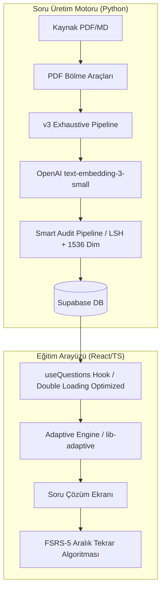

# 🦷 DUSBANKASI: Diş Hekimliğinde Uzmanlık Sınavı AI Eğitim Ekosistemi
**LLM (YAPAY ZEKA ASİSTAN) BAŞUCU MANİFESTOSU**

> [!IMPORTANT]
> **AI ASİSTAN:** Bu projede çalışmaya başladığınızda **İLK VE TEK REFERANSINIZ** bu belgedir. Projenin mimarisi, soru üretim kuralları ve klasör yapıları sıkı kurallara bağlanmıştır. Kullanıcının isteklerini bu belgeye göre yorumlayın.

DUSBANKASI, Diş Hekimliğinde Uzmanlık Sınavı (DUS) hazırlık sürecini **Yapay Zeka (AI)** ve **Bilişsel Bilim (Cognitive Science)** prensipleriyle optimize eden hibrit bir eğitim ekosistemidir.

---

## 🏛️ 1. MİMARİ BAKIŞ

**Tech Stack:** React 18 + TypeScript / Vite · Supabase (PostgreSQL + pgvector 1536) · Python 3.12 · NotebookLM

Uygulama iki temel katmandan oluşur: **Frontend Katmanı (React/Vite)** ve **Soru Üretim Katmanı (Python/NotebookLM)**.

### Sistem Akış Şeması


### Klasör Yapısı (Önemli Dosyalar)
```
DUSBANKASI/
├── src/
│   ├── App.tsx                  # Ana orkestrasyon, AppState yönetimi (Hız optimizasyonlu)
│   ├── hooks/
│   │   ├── useQuestions.ts      # Veri yükleme (Startup optimizasyonlu)
│   ├── components/
│   │   └── CurationDashboard.tsx # Olası ikizleri temizleme arayüzü
├── scripts/
│   ├── notebooklm-exhaust.py    # ⭐ ANA ÜRETİM MOTORU (Gemini 2.0 Flash)
│   ├── shared.py                # OpenAI Embedding (1536) ve Filtreler
│   ├── tools/
│   │   ├── smart_audit_pipeline.py # Otomatik Denetim (LSH + Semantic Match)
│   │   └── backfill_embeddings.py # Eski soruları OpenAI standardına çekme aracı
├── supabase-schema.sql          # DB şeması (vector 1536 uyumlu)
```

---

## ⚙️ 2. KURULUM

### Ortam Değişkenleri (`.env` ve `config.py`)

| Değişken | Açıklama | Lokasyon |
|---|---|---|
| `OPENAI_API_KEY` | Vektörleme (Embedding) için | `scripts/config.py` |
| `GEMINI_API_KEY` | Soru üretimi için | `scripts/config.py` |
| `VITE_SUPABASE_URL` | Supabase URL | `.env.local` |

---

## 🤖 3. YAPAY ZEKA SORU ÜRETİMİ & İŞ AKIŞI

Uygulama artık **"Yüksek Hassasiyetli Semantik Denetim"** modundadır. 

### 🚀 Güncel Üretim Akışı
1.  **Üretim:** `notebooklm-exhaust.py` ile sorular üretilir.
2.  **Vektörleme:** Her soru otomatik olarak **OpenAI 1536** boyutunda vektörlenir.
3.  **Otomatik Denetim:** Üretim bittiğinde `smart_audit_pipeline` otomatik tetiklenir ve kavramsal kopyaları `quality_flag = 'kavramsal_kopya'` olarak işaretler.
4.  **Temizlik:** Kullanıcı periyodik olarak aşağıdaki SQL ile kopyaları veritabanından süpürür:
    ```sql
    DELETE FROM questions WHERE quality_flag = 'kavramsal_kopya';
    ```

---

## 🧹 4. POST-PRODUCTION KALİTE KONTROLÜ (SMART AUDIT)

### Akıllı Kavramsal Denetim (LSH + Semantic Match)
Üretim bittiğinde sistem arka planda `smart_audit_pipeline.py` aracını **otomatik olarak** çalıştırır.

- **Vektör Hassasiyeti:** OpenAI 1536-dim vektörler kullanılarak iki sorunun "aynı şeyi sorup sormadığı" matematiksel olarak tespit edilir.
- **Kürasyon Mantığı (Ölüm Maçı):**
  - Klinik vaka içeren (uzun ve detaylı) sorular korunur.
  - "Değildir/Yanlıştır" gibi negatif köklü sorular elenme eğilimindedir.
  - Puanı düşük olan soru `kavramsal_kopya` işaretiyle havuzdan gizlenir.
- **Loglama:** Tüm işlemler `scripts/logs/flagged_questions.jsonl` dosyasına yazılır.

> [!TIP]
> Manuel denetim yapmak isterseniz: `python scripts/tools/smart_audit_pipeline.py --lesson Fizyoloji`

[Aşama 2] Akıllı Kürasyon (Ölüm Macı)
  Her şüpheli çift için:
  • Soru kökleri Jaccard < %20 → Farklı kavram, ikisi de korunur
  • Aynı kavramsa puan karşılaştırması yapılır:
     Klinik vaka içeriyor mu?  +10 puan
     "Hangisidir / Nedir"       +5 puan
     "Değildir / Yanlıştır"     -15 puan
     10 kelimeden kısa          -5 puan
  • Daha düşük puan alan elenecek listeye girer.

[Aşama 3] Otomatik Silme + Loglama
  Elenecekler Supabase'den kalıcı olarak silinir.
  Her silinen soru scripts/logs/deleted_questions.jsonl dosyasınaşu formatla loglanır:
  { "deleted_at", "lesson", "id", "question", "reason", "winner_id" }
```

**Tipik İş Akışı:**
```
NotebookLM 130 soru üretir
    ↓
Canlı Filtreler (bilgi sızıntısı vs) → 128 soru Supabase'e yazılır
    ↓
[Tüm batch'ler bittikten sonra — 1 kez]
python scripts/tools/smart_audit_pipeline.py --lesson Fizyoloji
    ↓
128 soru × 128 çapraz tarama → 19 kavramsal kopya tespit edildi
Ölüm Macı → 19 adet zayıf soru elendi + loglandı
    ↓
✅ 109 eşsiz + kaliteli soru veritabanında kaldı
```

> [!TIP]
> `scripts/logs/deleted_questions.jsonl` dosyası kümülatif bir kaygı defteridir. Her silme işlemi buraya eklenir ve neden silinildiği her zaman takip edilebilir.

---

## 🛠️ 5. YAN ARAÇLAR (Araç Çantası)

`scripts/tools/` klasörü içerisinde hazırlık ve veritabanı operasyonları için zengin Python araçları mevcuttur:

### ⭐ Veri Kalitesi ve Geri Alma (Rollback) Araçları

*Eski üretimlerin kalitesini denetlemek, kazaları geri almak veya silindikten sonra kurtarılabilecekleri geri çağırmak için bu araçları kullanın:*

**1. Kalite ve Kopya Denetimi (`bulk_quality_audit.py` & `check_expl_dupes.py`)**
Veritabanındaki soruları güncel `Quality Gate` filtrelerinden geçirerek `raporlar/` klasörüne JSON analizleri üretir. Tüm analiz sonuçları `.json` halinde bu dizinde saklanır.
- `python scripts/tools/bulk_quality_audit.py --lesson Fizyoloji` *(Bilgi sızıntısı olan soruları raporlar)*
- `python scripts/tools/check_expl_dupes.py --lesson Fizyoloji` *(Açıklaması %50'den fazla aynı olan Kavramsal Kopyaları bulur ve raporlar)*

**2. Rapor Üzerinden Toplu İmha (`delete_ids_from_report.py`)**  (YENİ)
Kullanıcı `raporlar/` klasöründeki çıktıları inceleyerek kalmasını istediği soruları dosyadan çıkarır. Dosyanın içinde kalan istenmeyen ID'leri Supabase veritabanından kalıcı olarak siler.
- `python scripts/tools/delete_ids_from_report.py raporlar/fizyoloji_expl_dupes.json --force`

**3. Toplu Geri Alma (`batch_rollback.py`)**
Yanlış üretilen partileri 3 katmanlı güvenlik kilidiyle geri alın! (Silinen sorular otomatik olarak lokal yedeğe kopyalanır)
- `python scripts/tools/batch_rollback.py --dry-run --lesson Fizyoloji --since 2026-04-18` *(Önce her zaman dry-run ile etkilenecek sorulara bakın)*
- `python scripts/tools/batch_rollback.py --lesson Fizyoloji --since 2026-04-18` *(Manuel "DELETE {N} SORULAR" onayı isteyerek siler)*

**3. Kurtarıcı (`requeue_rejected.py`)**
`recovery/rejected/` ünitesindeki reddedilmiş soruları güncel ve esnetilmiş filtrelerden tekrar geçirerek kurtarmayı dener.
- `python scripts/tools/requeue_rejected.py --dry-run` *(Ne kurtarılacağına risksizce bakar)*
- `python scripts/tools/requeue_rejected.py --push` *(Geçen soruları doğrudan Supabase'e iter)*
- `python scripts/tools/requeue_rejected.py --lesson Fizyoloji` *(Kurtarılanları incelenmek üzere recovery/pending/ içine atar)*

### 🔍 Analiz ve Hazırlık Araçları

| Araç | Komut | Ne Zaman |
|---|---|---|
| PDF Bölme | `python scripts/tools/split_pdf_auto.py` | 600+ sayfalık PDF'i 20-30 sayfalık ünitelere ayır |
| DB Soru Sayısı | `python scripts/tools/check_db_all.py` | Veritabanındaki toplam soru dağılımını gör |
| Karakter/Font Haritası | `python scripts/tools/advanced_map.py` | PDF'te bozuk karakter/font sorunlarını tespit et |
| PDF Analizi | `python scripts/tools/analyze_pdf.py` | İçerik yapısını ve sayfa dağılımını incele |

> `scripts/recovery/rejected/` — Kalite Gate'den geçemeyen, reddedilen sorular burada arşivlenir.

---

## 💻 5. FRONTEND (UI/UX) KATMANI

Kullanıcı arayüz, tasarım (CSS/Tailwind) veya React tarafında değişiklik isterse:

### UI Mimarisi ve Gezinme Rehberi
- **`src/App.tsx`**: Ana orkestrasyon dosyası. Görünümler arası geçiş ve `AppState` yönetimi.
- **`src/hooks/useQuestions.ts`**: Supabase ile CRUD işlemleri ve optimistic updates.
- **`src/components/quiz/QuizView.tsx`**: Soru çözüm ekranı — UI/UX geliştirmeleri burada yapılır.
- **`src/lib/adaptive.ts`**: Akıllı soru seçim motoru. 3 sinyalle ağırlıklandırılır:
  - FSRS Urgency **%50** · Weakness Score **%35** · New Exploration **%15**
  - Ayrıca ardışık aynı dersin gelmesini önleyen **Interleaving** filtresi.
- **`src/lib/fsrs.ts`**: Kullanıcı tepkisine (Zor/Orta/Kolay) göre soruların tekrar ihtimalini planlayan FSRS-5 modeli.

### Tasarım (Design System) Felsefesi
Uygulama tasarımında "Aesthetic Usability Effect" (Estetik Kullanılabilirlik Etkisi) gözetilir:
1. **Apple/Linear Ekolü:** Keskin zıtlıklar, düşük bilişsel yük, şık monokrom/koyu tema üzerine minimalist pastel dokunuşlar.
2. Ad-hoc renkler yerine `var(--color-bg-primary)` gibi **semantic CSS tokenları** (`src/index.css`) kullanılır.

---

## 🛑 6. YASAKLAR (AI İÇİN KATI KURALLAR)

> [!WARNING]
> Aşağıdaki kurallara uymak zorunludur. İstisna yoktur.

1. Yeni soru üretiminde asla `scripts/_archive/` altındaki eski scriptleri (`ai-import.ts`, `notebooklm-auto.py` vb.) çalıştırma. **Sadece V3 Exhaustive motorunu kullan.**
2. Supabase tablosu hakkında soru gelmeden önce `supabase-schema.sql` dosyasını referans al — "DB'ye bağlan" demeden şemayı oku.
3. Sorulardaki `explanation` kısımlarında asla motivasyonel cümleler kurma ("Harika!", "Unutma ki..."). Daima **Root-Cause (kök neden)** ve **klinik bağlam** ağırlıklı, mekanik açıklamalar yap.
# xxq

